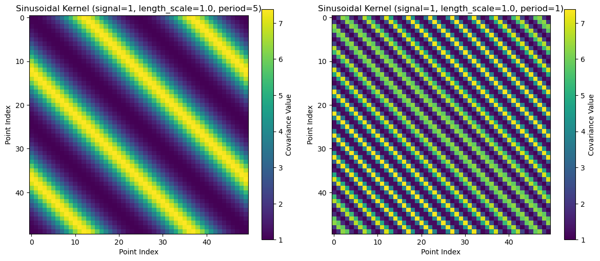
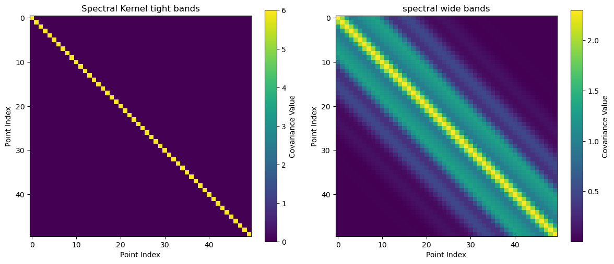
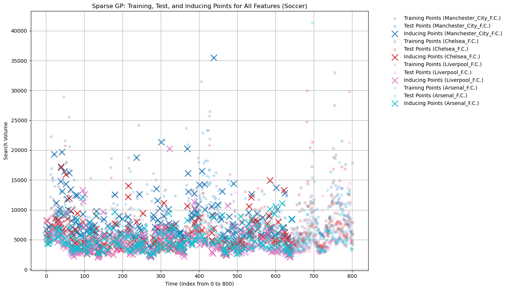
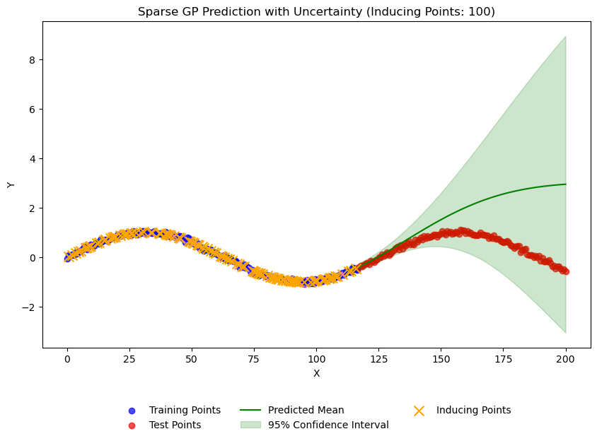
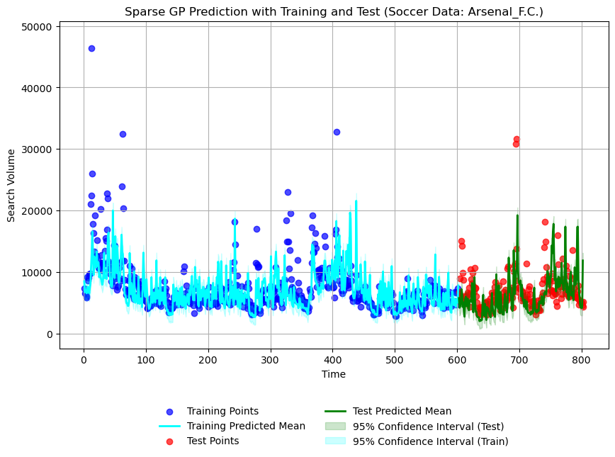

# README

This repository contains code and experiments from our research on combining multiple kernels within a Sparse Gaussian Process (GP) framework for correlated web traffic forecasting. Our approach leverages a variety of kernels—Squared Exponential, Spectral Mixture, Matérn, Linear, and Sinusoidal—to capture complex temporal patterns. By optimizing the Evidence Lower Bound (ELBO), we tune kernel weights and hyperparameters, investigating how each kernel contributes to forecast accuracy and uncertainty estimation.

## Files and Directories

- **exp_inducing_points.ipynb**  
  Experiment investigating how varying the number of inducing points affects the model’s performance and efficiency.

- **exp_kernel_weights.ipynb**  
  Experiment testing kernel optimization on filtered datasets (Soccer, Politics, and Technology) to identify which kernels play a more dominant role.

- **exp_step_size.ipynb**  
  Experiment exploring the impact of step size in ELBO maximization on convergence, predictive performance, and uncertainty calibration.

- **kernels.py**  
  Contains implementations of various kernels:
  - Squared Exponential (SE)
  - Spectral Mixture (SM)
  - Matérn
  - Linear
  - Sinusoidal

- **data.py**  
  Data preprocessing and manipulation methods, including:
  - Splitting input-output matrices
  - Cleaning and filtering data (e.g., median filtering)
  - Optional normalization

- **plot.py**  
  Visualization utilities to generate plots of time series, forecasts, ELBO curves, and kernel weight distributions.

- **test_kernels.ipynb**  
  Preliminary tests ensuring correct kernel implementations.

- **test_simple2D.ipynb**  
  A toy experiment using a simple 2D dataset to verify the pipeline before applying it to more complex web traffic data.

- **sparse_gp.py**  
  Implementation of the Sparse Gaussian Process and ELBO-based variational inference, including:
  - Variational optimization of inducing points and kernel hyperparameters
  - Computation of ELBO, predictive distributions, and other components of the GP framework

## Kernels and Their Representations

We combine multiple kernels to capture different aspects of time series behavior. Some kernels model smooth variations, others handle periodicity or complex frequency structures. Below are covariance heatmaps for two illustrative kernels:

**Sinusoidal Kernel Covariance Heatmap:**  
Captures periodic patterns in the data.  

**Spectral Mixture Kernel Covariance Heatmap:**  
Handles multi-periodic or complex frequency patterns through a Gaussian mixture in the spectral domain.  

## Sparse Gaussian Processes and Inducing Points

Traditional GPs scale poorly for large datasets. Sparse GPs address this by using a set of inducing points \( M \ll N \) to approximate the full GP, reducing computational complexity from \(\mathcal{O}(N^3)\) to \(\mathcal{O}(M^2N)\).

**Inducing Points Visualization:**  
This figure conceptually shows how inducing points represent a compressed summary of the data, balancing complexity and scalability.  

## Data and Preprocessing

We apply our methods to subsets of the Wikipedia Traffic Data Exploration dataset (2015-2017). Our focus is on correlated web traffic time series—e.g., English Premier League soccer clubs, political figures, and major technology companies.

To handle outliers or extreme behavior, we experimented with median filtering. While it improved performance in some datasets, certain datasets like the unfiltered soccer data still yielded strong forecasts, potentially because there were no extreme anomalies to remove.

## Experimental Results

1. **Toy Example (Simple 2D Data):**  
   Before tackling real-world complexity, we validated our approach on a simple toy dataset. This ensures that our code and methods function correctly in a controlled scenario.  
   

2. **Soccer Dataset (Unfiltered):**  
   On this raw dataset—without median filtering—our model could still identify underlying patterns. This suggests that when data aren’t plagued by severe outliers, filtering may not be necessary.  
   

In contrast, for datasets like Politics or Technology (not shown here), median filtering helped stabilize the model due to more erratic search volume patterns. The experiments showed that:
- Some kernels never fully dropped to zero weight, indicating even less dominant kernels still offered incremental improvements.
- Step size tuning affected how confidently (and how accurately) the model predicted.
- Varying inducing points had less impact than anticipated, suggesting a broad robustness in how the sparse GP model leveraged them.

## Reference Paper

For more details, see our accompanying paper, *"Kernel Combinations for Sparse Gaussian Processes in Correlated Web Traffic Forecasting"*. It provides:

- **Introduction:**  
  Motivation for Sparse GPs and multiple kernels in time series forecasting.

- **Related Work:**  
  Background on kernel methods, sparse approximations, and time series synchronization.

- **Methods:**  
  Data preprocessing, model formulation, ELBO optimization, and the role of inducing points.

- **Experiments:**  
  Detailed analysis of step size, inducing points, and kernel weight optimization results.

- **Discussion:**  
  Insights into kernel combinations, uncertainty calibration, and directions for improving model interpretability and robustness.

## How to Use

1. **Data Preparation:**  
   Use `data.py` to preprocess your dataset into the required format.

2. **Running Experiments:**  
   - `exp_step_size.ipynb`: Test different step sizes.
   - `exp_inducing_points.ipynb`: Vary inducing points.
   - `exp_kernel_weights.ipynb`: Optimize kernel weights on filtered datasets.

   For initial checks:
   - `test_kernels.ipynb`: Verify kernel implementations.
   - `test_simple2D.ipynb`: Run a toy scenario.

3. **Visualization:**
   Use `plot.py` to generate plots and `data_imgs/` for reference images or saved figures.

## Additional Notes

- The optimization is non-convex. Expect that different initializations, step sizes, or noise parameters can lead to diverse outcomes.
- Sparse GPs are effective for large datasets but require careful tuning of hyperparameters and kernel weights.
- Overconfidence in some forecasts suggests future work could focus on better noise handling, priors, or adaptive kernel compositions.

## License

This project is for research and educational purposes. If you use our methods or code, please cite the accompanying paper.
